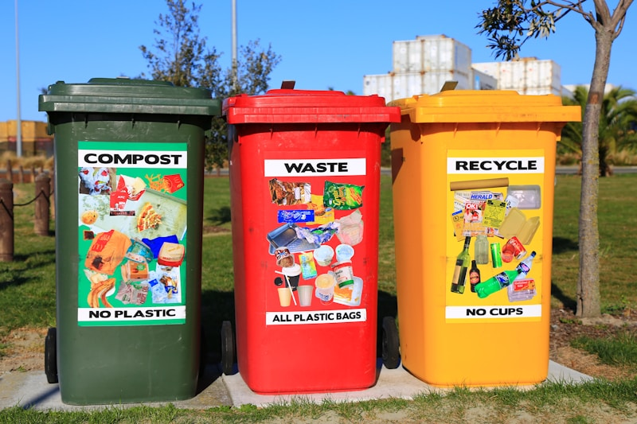

UK just set a target: cut residual waste by 50% by 2042.

Residual waste is everything that doesn't get recycled or composted. The stuff that ends up in landfills or gets incinerated. Right now it's about 437 kg per person per year. They want to cut that in half.

Emma Reynolds, the Environment Secretary: "Our environment faces real challenges, with pollution in our waterways, air quality that's too low in many areas, and treasured species in decline."

This isn't just about waste. It's about redesigning how we make and use stuff in the first place. Dan Cooke from CIWM: "A fundamental shift in how resources are valued and managed is required."

The plan includes three big reforms:
- How we collect waste
- How packaging gets designed
- How manufacturers take responsibility

But there's a gap. The government pushed back the first deadline from 2028 to 2030. That's two extra years before real action starts. And they're still dealing with illegal dumping and waste crime, which nobody talks about enough.

What we're missing is the same problem as with recycling: data and transparency. How do you track if waste actually went down, or if it just moved somewhere else? How do you prove a manufacturer designed packaging to reduce waste, not just claim it?

At Value Chain Hackers, we're working on exactly this. Building systems that can trace materials and verify claims instead of just trusting company reports. Because waste reduction only works if you can measure it properly.

The question is: how do you get manufacturers, local authorities, waste companies, and regular people all working together when everyone has different incentives?

What's happening with waste reduction where you are? Are you seeing real changes or just new targets?

https://www.circularonline.co.uk/news/uk-government-targets-50-cut-in-residual-waste-by-2042/

#WasteReduction #CircularEconomy #Sustainability #SupplyChain #ValueChainHackers #ZeroWaste #EnvironmentalPolicy #ResourceManagement #SupplyChainTransparency #SustainableSupplyChain
