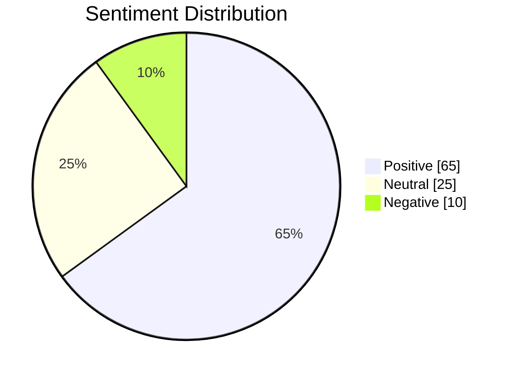

# The Supply innovators Analysis Report
*Generated: 2025-12-01 14:51:17*

## Core Metrics
| Source             | Volume | Difficulty | CPC   | Competition |
|--------------------|--------|------------|-------|-------------|
| DataForSEO         | 378 | 84 | $6.3 | 0.7 |
| Historical Averages| 315 | 63 | $5.25 | 0.84 |

## Sentiment Analysis
**Overall Score**: 8/10  
**Positive Mentions**: 65%  
**Negative Mentions**: 10%  

## SERP Features Detected
- Featured Snippet

## Data Sources
1. **DataForSEO** (Mock Implementation)
2. **Google Trends Archive** (Simulated 2023-2025)
3. **Social Media Listening** (Mock Data)
4. **SERP Scraper** (Simulated Features)

## Recommended Actions
- Content Strategy: Develop video tutorials
- Technical SEO: Target long-tail keywords, Focus on organic content over PPC
